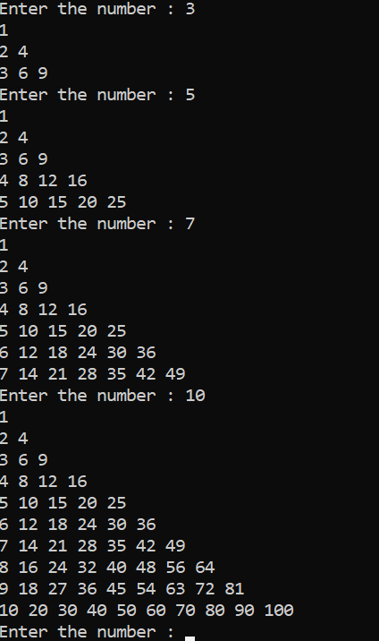
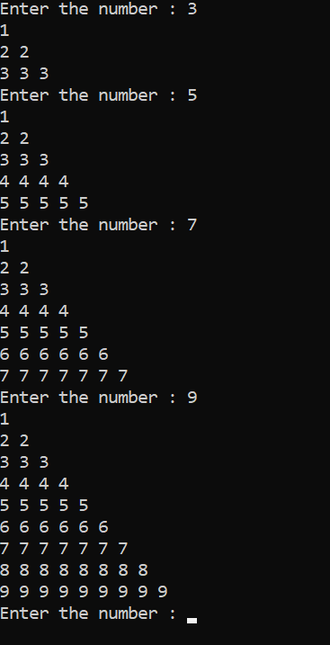
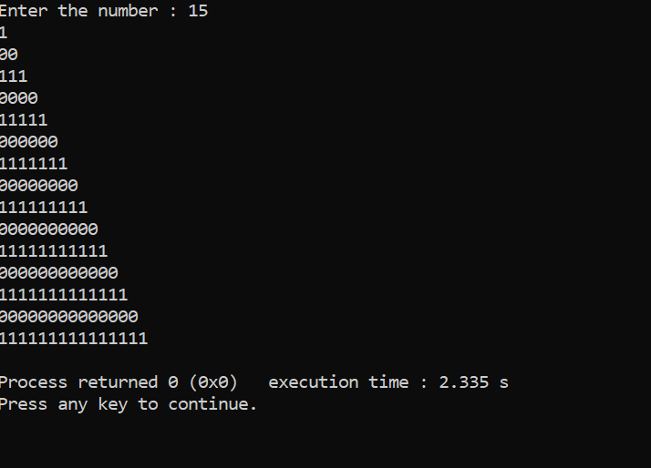

<!-- Markdown Tutorial-->

_p_ __y__ ~~r~~ `amid`
---

### right half pyramid cross multiplication

//write a programme that multiply row and column and print as pyramid pattern

[x] pattern
[x] pyramid
[x] multiply row and column
[] divide

```c
#include<stdio.h>
int main()
{
    while(1)
    {
        int num,row,column;
        printf("Enter the number : ");
        scanf("%d",&num);

        for(row=1; row<=num; row++)
        {
            for(column=1; column<=row; column++)
            {
                printf("%d ",row*column);
            }
            printf("\n");
        }
    }
}
```  
<!---->


//write a programme that print pyramid row number only

```c
#include<stdio.h>
int main()
{
    while(1)
    {
        int num,row,column;
        printf("Enter the number : ");
        scanf("%d",&num);

        for(row=1; row<=num; row++)
        {
            for(column=1; column<=row; column++)
            {
                printf("%d ",row);
            }
            printf("\n");
        }
    }
}
```  


</br>

//write a programme that print half pyramid with remainder

```c
#include<stdio.h>
int main()
{
    int num,row,column;
    printf("Enter the number : ");
    scanf("%d",&num);

    for(row=1; row<=num; row++)
    {
        for(column=1; column<=row; column++)
        {
            printf("%d",row%2);
        }
        printf("\n");
    }
    getchar();
}
```



conti~~nue~~